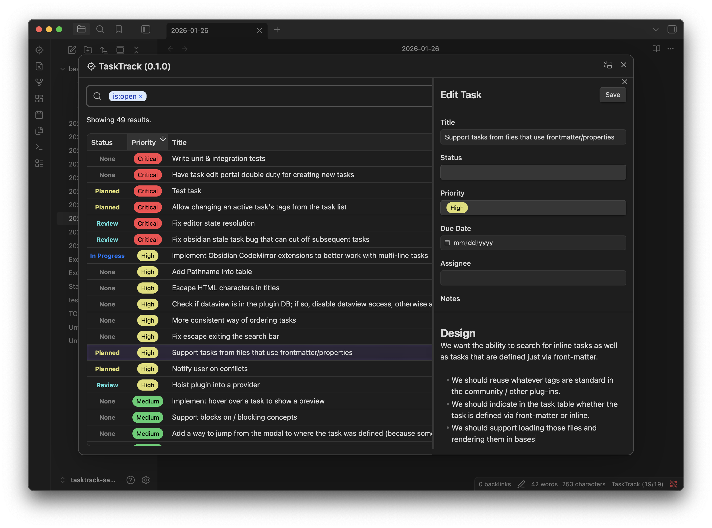

# TaskTrack (Alpha)

**Get your life on the fast track.** An obsidian task management tool that supports both dedicated modal and Bases usage. Merges inline task lists with Bases-compatible task documents so your tasks grow with you.



Example of inline tasks:

```markdown
# Daily note

- [x] Pick up groceries from store
- [ ] Prepare vegetables
  - [ ] Marinate tofu !!!
```

**(WIP) Roadmap**

- Mobile support
- Support tasks from frontmatter
- Moving tasks around to different files, to/from frontmatter
- Bases support
- Extended metadata, including non-dataview style tags
- And more, start a [discussion](https://github.com/tcr/tasktrack-obsidian-plugin/discussions) if you're interested

## Installing

At the moment, [BRAT (Beta Reviewer's Auto-update Tool)](https://tfthacker.com/brat-quick-guide) is the easiest way to install TaskTrack. Use the repo `https://github.com/tcr/tasktrack-obsidian-plugin` and set the tag to "latest".

<!--
(WIP) This is also a task:

```toml
---
tags:
  - task
priority: medium
due-date: 2026-01-17
---

TaskTrack requires a way to edit Markdown inline inside of the task view, to support both inline task descriptions and full task documents. Here's the proposed design:
```

Both can be managed in the same modal:

{Picture}

Or make dedicated Bases that combine both as well:

{Picture}
-->

## Contributing

This repo uses:

- TypeScript
- Vite for bundling
- Vitest for testing
- Preact as our JSX library
- Tailwind for CSS

Please make an issue if you've found a bug, [start a discussion](https://github.com/tcr/tasktrack-obsidian-plugin/discussions) if you have a proposal, or create a Pull Request if you've implemented any fixes.

## License

MIT
